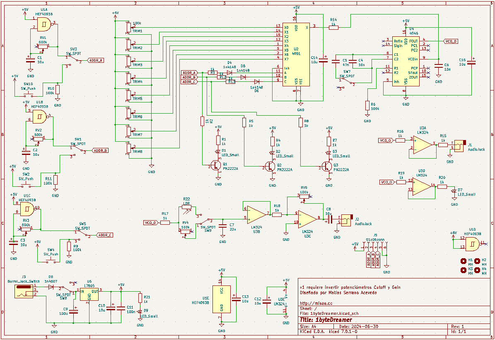
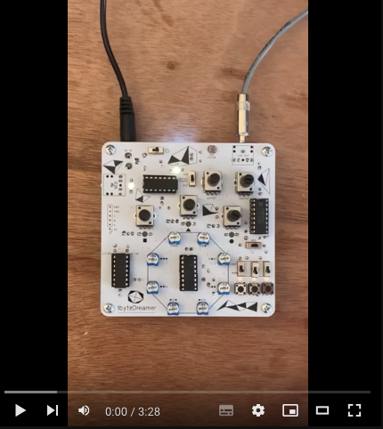
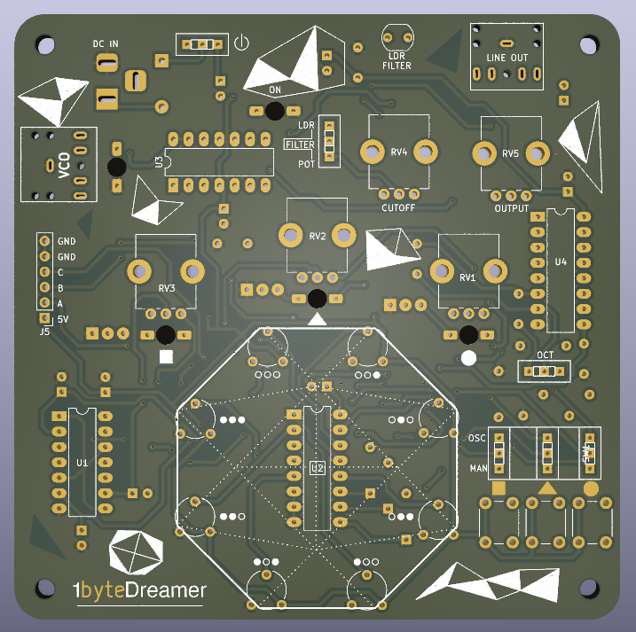
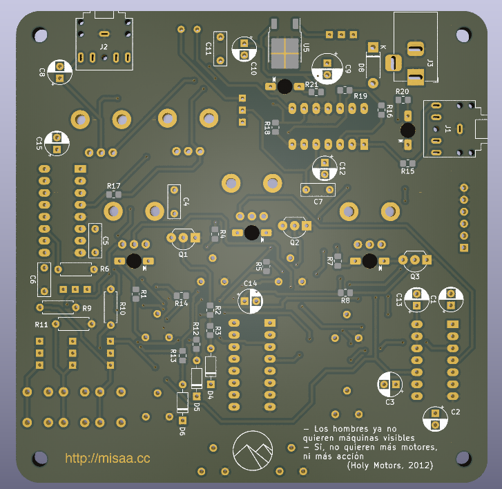

# 1byteDreamer
Sintetizador controlado por 1byte
## Especificaciones
- Secuenciador de irregular ritmo y frecuencia
- 8 voltajes disponibles según banco de potenciómetros (trims)
- El voltaje del VCO es decidido según el número construido por 3 bits
- Control manual de cada bit por medio de botones
- 2 rangos de frecuencia posibles
- Filtro controlado por potenciómetro o luz
- Control de nivel de salida
- Salida de línea
- Salida de VCO
- Salida de cada oscilador disponible
## Esquemático

## Video de referencia (enlace externo)

## Imágenes PCB

